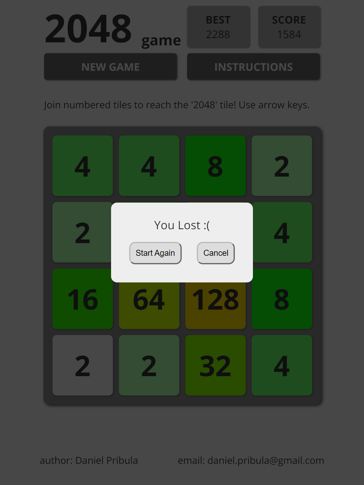
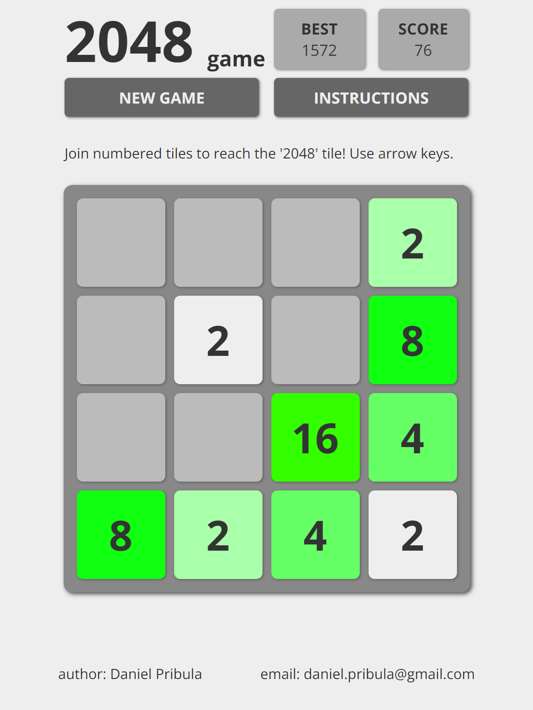

# 2048 Game

## Purpose of the Project
The 2048 game is a digital adaptation of the popular puzzle game. It aims to provide users with an engaging and challenging gaming experience where they combine numbered tiles strategically to reach the coveted "2048" tile.

## Overview
The 2048 game project is a web-based application designed to entertain users while challenging their strategic thinking and problem-solving skills. The game features a 4x4 grid where tiles with varying numbers can be combined by swiping or using arrow keys to merge them and ultimately reach the 2048 tile.

## User Stories
- **As a player new to 2048**, I want clear instructions on how to play the game.
    - Instructions are provided for easy understanding.
- **As a casual gamer**, I want a user-friendly interface to navigate the game effortlessly.
    - The game interface is intuitive and easy to navigate, making it addictive to play.
- **As a strategic thinker**, I want the game to provide challenging yet achievable goals.
    - The game offers challenging goals while ensuring they are achievable, keeping players engaged.
- **As a mobile user**, I want the game to be responsive and playable on my device.
    - The game is optimized for smaller screens and responds to swipes. Additionally, it prevents accidental webpage refreshing when swiping down.
- **As a competitive player**, I want my high score to be tracked and displayed.
    - The game tracks and displays the player's current score in real-time. Additionally, the top score achieved in a single game session is recorded and displayed.

## Features
- **Instructions:** Clear instructions provided at the beginning of the game to guide players on how to play.
- **Responsive Design:** The game is designed to be playable across various devices, including desktops, laptops, tablets, and smartphones.
- **Scoring System:** A scoring system tracks and displays the player's current score as they merge tiles.
- **High Score:** The game keeps track of the player's highest score achieved during the session.
- **Controls** By keybord arrow keys and swipe or mosue
- **Reset Functionality:** Players can start a new game at any time to reset the board and their score.

## Structure
The game interface consists of the following elements:
- **Logo:** A simple, text-based element stating "2048 game", reflecting the simplicity and beauty of the game's logic.
- **Grid:** A 4x4 grid displaying numbered tiles that can be merged.
- **Display Game Score:** Shows the user's current score during gameplay.
- **Display Best Score:** Keeps track of the user's best score locally.
- **Instructions Button:** Provides brief instructions on how to play the game.
- **New Game Button:** Allows players to start a new game at any time.
- **Footer:** Includes developer contact information.

## Development Process
1. **Initial Setup:** Set up the basic HTML structure and CSS styling for the game interface.
2. **Grid Implementation:** Implemented the logic for generating and displaying the game grid with numbered tiles.
3. **Tile Movement:** Implemented the functionality for swiping and arrow key input to move tiles across the grid.
4. **Tile Merging:** Implemented the logic for merging tiles with the same number when they collide.
5. **Scoring System:** Added functionality to track and update the player's score based on tile merges.
6. **High Score Tracking:** Implemented a mechanism to store and display the player's highest score.
7. **User Interface:** Designed and implemented the visual elements of the game interface for a polished look and feel.
8. **Testing and Optimization:** Conducted thorough testing to ensure the game functions as intended across different devices and browsers. Optimized performance and fixed any bugs or issues encountered during testing.

## Future Enhancements
- **Scoreboard:** Displays the player's current score and highest score achieved.
- **Pause Game** Allows players to safely pause game at any time and come back later.
- **Undo Functionality:** Allow players to undo their last move for added flexibility up to 3 times.
- **Customizable Themes:** Provide options for players to choose different color themes for the game interface.
- **Multiplayer Mode:** Implement a multiplayer mode where players can compete against each other online
- **Accessibility Features:** Enhance accessibility by adding support for screen readers and keyboard navigation.
- **Tile Animation:** Smooth animations enhance the gaming experience by providing visual feedback when tiles merge.
- **Sound Effects:** Optional sound effects add an immersive element to the gameplay experience.
- **Advanced Strategies:** Integrate AI algorithms to provide hints or strategies for optimal gameplay.
- **Vertical Fit:** Ensure the game adapts to prevent screen vertical height limits. For wide screens with small scaling, initiate vertical fit ensuring the game field remains fully visible on screens taller than 460px.

## Solved Bugs
- In conditioms, like if(squares[ind].innerHTML === '0'), string is used, instead not mixing it with integer (squares[ind].innerHTML == 0).
- Modal replaced Promt For Game won or Game lost message being delivered.
- Prevent algorithm running outside of array range - game filed when looping thorugh it.
- Prevent generating new number when nothing moved or merged.
- Prevent swipe down and refresh game on touch devices.
- Removed the link from the logo to prevent accidental clicks during gameplay.

## Unsolved Bugs
- **Overscroll behavior** has been managed through CSS styling to prevent unintended page refreshes, particularly when users engage with the game on the Android Chrome browser. However, it doesn't entirely hinder users from inadvertently moving the game board around when swiping, especially when zoomed in. To ensure seamless control, users are advised to zoom out to play the game comfortably.
- **Game logic error** recently discovered due to a flaw in my script's logic. The correct game logic for the array [2, 2, 2, 2] after a move should result in [4, 4, 0, 0], which functions as expected. However, in the case of [2, 2, 0, 4], the result is [8, 0, 0, 0]. The issue lies in the algorithm's, where first it correctly merges the 1st and 2nd elements to yield [4, 0, 0, 4]. Subsequently, the flawed logic merges the 1st and 4th elements, resulting in [8, 0, 0, 0].

| Next move is slie up, should be resulting  in two fours| Faulty script logic merges it to one eight number, also show two no.2 grey boxes, which sholud be already light green |  |  |  |
|:-:|:-:|:-:|:-:|:-:|
| |  | | |  |


## Technologies Used
- **HTML:** Used for the structure and layout of the game interface.
- **CSS:** Used for styling and visual design of the game elements. [Google fonts](https://fonts.google.com/) have been used.
- **JavaScript:** Used for implementing the game logic, user interactions, and dynamic behavior.
- **Responsive Design:** Utilized CSS media queries and flexible layouts to ensure compatibility across devices.
- **[ChatGPT](https://chat.openai.com/)** Used to help to find css solutions, find javascript code mistakes, gnenaerate bits of javascirpt or css, improving javascript code, generating structure for this readme etc.
- **Excel:** Used to geneare colorMap with smooth colour tranzition to next number.

## Testing
The website was tested in the Google Chrome browser for various screen sizes.
Web accessibility evaluation was tested with [Wave](https://wave.webaim.org/):
- [index.html](https://wave.webaim.org/report#/https://houndhunger.github.io/2048/)
No Errors or Alerts were identified.

Analyzing with Lighthouse in Google Chrome was done with full 100% score:


## Supported screens and browsers
The website was developed and tested on Google Chrome. It's working correctly for Small screen sizes, like Galaxy Fold, as well as for large screens. File style.css optimizes web for these screen width changes: 365px and 487px.

*Image was generated using this [blog](https://ui.dev/amiresponsive?url=https%3A%2F%2Fusersnap.com%2Fblog)

### Code validation 
- **HTML** code was validated successfully with no errors or warnings:
- [index.html](https://validator.w3.org/nu/?doc=https%3A%2F%2Fhoundhunger.github.io%2F2048%2F)
- **CSS** validation with no errors:
- [style.css](https://jigsaw.w3.org/css-validator/validator?uri=https%3A%2F%2Fhoundhunger.github.io%2F2048%2Fassets%2Fcss%2Fstyle.css&profile=css3svg&usermedium=all&warning=1&vextwarning=&lang=en)
- **JavaScript** errors or potential problems were identified with [JSHint](hhttps://jshint.com/). New JavaScript features (ES6) settings is turned on.
Results show no errors.
Metrics identified areas for code improvement, but due to time constraints, I couldn't address them fully. Future updates will optimize the code and possibly split it into multiple files.

### Test Cases
**PLAY GAME**
- User plays the game, sliding and merging tiles to achieve higher numbers.

|Two numbers appears randomly | Slide down | Slide left | Slide down |  |
|:-|:-|:-|:-|:-|
|  |  |  |  |  |

---
---

**GAME END & BEST SCORE**
- User ends the game and surpasses their previous best score, ensuring successful updating of the best score.

| Game end is near, next slide goes down | Next slide goes left | Board is full, next slide needs to be merge or end of game | End of game with new High score | New game |
|:-|:-|:-|:-|:-|
|  |  |  |  |  |

---
---

**GAME END - LOST**
- User loses the game, triggering a modal popup message and potentially updating the best score. Both ending the game and restarting function correctly.

|End end of game is near, next is slide up | Board is full, next slide ends the game | Game is lost without new high score | New game| |
|:-|:-|:-|:-|:-|
 |  |  |  | 

---
---

**GAME WIN & BEST SCORE**
- User wins the game, resulting in a modal popup message and possible update of the best score. Both ending the game and restarting work as expected.

| End end of game us near, next is slide down | Next is slide up | Board is full, next slide ends the game | Game is Lost with new high score, best score is updated | New game starts by clicking Start Again |
|:-|:-|:-|:-|:-|
|  |  |  |  |  |

---
---

**INSTRUCTIONS**
- User clicks on the INSTRUCTIONS button, causing the instructions to slide down and up. Additionally, the instructions slides back up when the user starts playing with Arrow Up key, bringing the game board back into view.

| New game | User clicks on INSTRUCTIONS button, Instructions slides down | Next user hits Arrow Up key and Instructions rolls back up |  |  |
|:-|:-|:-|:-|:-|
|  |  |  |  |  |

---
---

**NEW GAME**
- User restarts the game, initiating in by clicking on NEW GAME button. 
First time user Cancel andd plays one more move. Then initiates it and confirms it by clicking on Start againa new game successfully by resetting the board, tiles, and score.

| In the middle of the game | User hits NEW GAME button, but Cancel it | This brings him back to game, next slide is left | User hits NEW GAME button again and confirms it by clicking on Start Again | This wil start new game |
|:-|:-|:-|:-|:-|
|  |  |  |  |  |


## Deployment
The 2048 game can be deployed as a standalone web application or hosted on a web server for online access. It can be easily integrated into existing websites or platforms for users to enjoy.

### Via Gitpod
1. Upon starting the Gitpod online workspace,
2. I initiated a Python web server using the command: ```"python3 -m http.server"```
3. Gitpod prompted me to open the website within its environment.
4. After making updates and saving them on Gitpod,
5. I refreshed the website to reflect the changes.

### Via GitHubb pages
- The website is publicly accessible on GitHub:  [2048 game app](https://houndhunger.github.io/2048/)
- The website repository is hosted at: [2048 game repository](https://github.com/houndhunger/2048)

Upon completing any modifications:
1. I added the changes using the command: ```git add .```
2. Followed by committing them with a descriptive message: ```git commit -m “Something done”```
3. Finally, I pushed the changes to the GitHub repository: ```git push```
4. Refreshing the [2048 game](https://houndhunger.github.io/2048/) webpage reflected the updates.

## Credits
- The original 2048 game was created by Gabriele Cirulli. My project is inspired by his innovative game concept.
- Game is already on github as vanila game. [GitHub - kubowania - 2048](whttps://github.com/kubowania/2048/)
- [Game algorithm](https://www.baeldung.com/cs/2048-algorithm)
I went through quckly the structure of the code to give me a hint and kickstart. Since first function, I aranged the code myself.
- Some inspiration also [working game](https://2048game.com/)
- Some online tutorials, like help with [flexbox](https://css-tricks.com/snippets/css/a-guide-to-flexbox/), provided valuable insights and assistance during the development process, but mostly assitance from ChatGPT.
- Big Thank You to my mentor Rohit Sharma who points me right direction every time.

## License
This project is open-source and available under the MIT License. Feel free to fork, modify, and distribute the code for educational or commercial purposes.

---

Enjoy playing 2048 and have fun merging tiles to reach the elusive 2048 tile!